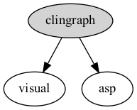

# clingraph

A **declarative visualizer for graphs** defined as a set of facts. The graphs are generated using [graphviz](https://graphviz.org) but are defined via fixed predicates that can be computed from logic programs. 

***Graph defined by facts***
```prolog
node(clingraph). node(visual). node(asp).
edge((clingraph,visual)). edge((clingraph,asp)).
attr(node,clingraph,style,filled).
```
***Visualization***


Clingraph also contains **special features** for integration with **[clingo](https://potassco.org/clingo/)**, as well as for generating **latex** code and **gifs**!

Check out our paper **[here](https://arxiv.org/pdf/2303.10118.pdf)**. This work was published in LPNMR22 where it recived the *"Best student paper award"*.

### Usage

Look at our [documentation page](https://clingraph.readthedocs.io/en/latest/) to see how to use clingraph.

Try clingraph via [command line](https://clingraph.readthedocs.io/en/latest/clingraph/console.html) or as a package online in a jupyter notebook via [](https://mybinder.org/v2/gh/potassco/clingraph/master?labpath=notebook.ipynb)


### Examples

Our **[examples folder](https://github.com/potassco/clingraph/tree/master/examples)** shows how to use the range of functionalities in different applications. 

- Examples used in the documentation ([doc](https://github.com/potassco/clingraph/tree/master/examples/doc))
  - *Attribute definition* ([example1](https://github.com/potassco/clingraph/tree/master/examples/doc/example1))
  - *Multi graphs* ([example2](https://github.com/potassco/clingraph/tree/master/examples/doc/example2))
  - *Subgraphs* ([example3](https://github.com/potassco/clingraph/tree/master/examples/doc/example3))
  - *Complex attributes* ([example4](https://github.com/potassco/clingraph/tree/master/examples/doc/example4))
  - *Clingo integration with multi model* ([example5](https://github.com/potassco/clingraph/examples/doc/example5))
  - *Latex integration* ([example6](https://github.com/potassco/clingraph/tree/master/examples/doc/example6))
- Simple ([color](https://github.com/potassco/clingraph/tree/master/examples/color), [cube](https://github.com/potassco/clingraph/tree/master/examples/cube), [lights](https://github.com/potassco/clingraph/tree/master/examples/lights))
- Clingo integration ([sudoku](https://github.com/potassco/clingraph/tree/master/examples/sudoku), [reify](https://github.com/potassco/clingraph/tree/master/examples/reify), [transition_system](https://github.com/potassco/clingraph/tree/master/examples/transition_system))
  - *Absolute positioning*
  - *Legends*
  - *Latex integration*
- Dynamic applications ([asprilo](https://github.com/potassco/clingraph/tree/master/examples/asprilo), [elevator](https://github.com/potassco/clingraph/tree/master/examples/elevator), [minotaur](https://github.com/potassco/clingraph/tree/master/examples/minotaur))
  - *Clingo integration*
  - *Multi graphs*
  - *Animation via Gif*
- SVG interaction ([family_tree](https://github.com/potassco/clingraph/tree/master/examples/family_tree), [queens_interactive](https://github.com/potassco/clingraph/tree/master/examples/queens_interactive), [minesweeper](https://github.com/potassco/clingraph/tree/master/examples/minesweeper))
  - *Interaction using SVG*
- Visualizing  the [solving](https://github.com/potassco/clingraph/tree/master/examples/propagator) and [program structure](https://github.com/potassco/clingraph/tree/master/examples/ast)


## Installation

### Requirements

- Python (version 3.8, 3.9, or 3.10)

For instructions to install from source, pip and conda see our [documentation page](https://clingraph.readthedocs.io/en/latest/clingraph/installation.html).
