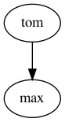
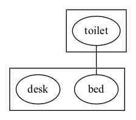
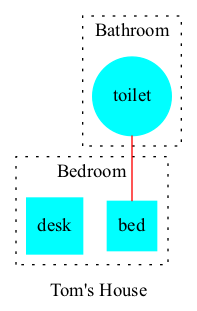
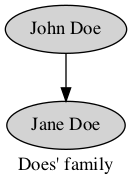

# clingraph

A visualizer for graphs defined as logic programs.

It extends [clingo](https://potassco.org/clingo/) with the automatic generation of graphs using [graphviz](https://graphviz.org).
The graphs are defined via fixed predicates in the logic program.


## Installation

Standing on the root folder install all dependencies:

```
pip install .
```

This will make the command `clingraph` available for usage.

## Usage

*Clingraph* will pass the provided files to clingo and generate a graph for each stable model that is printed. The graphs can be saved in several formats using a valid engine.

```shell
clingraph --help
```
```shell
Clingraph Options:

  --directory=<str>       : Directory for saving and rendering
         * Default: \out
  --format=<arg>          : Rendering output format
        <arg>: {gv|pdf|png|svg}
         * Default: gv (the graphsviz text format)
  --type=<arg>            : Type of graph
        <arg> : {graph|digraph}
            graph: not-directed
            digraph: directed
         * Default: digraph
  --engine=<arg>          : Layout command used
        <arg>: {dot|neato|twopi|circo|fdp|osage|patchwork|sfdp}
         * Default: dot
  --prefix=<str>          : Prefix used for the predicates to consider
  --default-graph=<str>   : The name of the default graph
        All nodes and edges with arity 1 will be assigned to this graph
         * Default: default
  --[no-]view             : Render the answers and show them with the default
        viewer if they are images
  --[no-]gif              : Generate a gif from all graphs
  --[no-]postfix          : Saves output in the same directory using the model
        number as postfix on the file name
         * Default: each stable model is saved in a different directory.
```
To define the graphs one must use predicates `node`, `edge`, `graph` and `attr` as explained below (a custom prefix for these names can be defined in the command line). All the following examples can be found in the [examples/basic](./examples/basic) directory.

### Syntax

- #### **Nodes**

  A node is defined using predicate `node/1` where the argument is an identifier.

  ###### *Example 1*
  ```
  node(john).
  node(jane).
  ```

- #### **Edges**

  An edge from `A` to `B` is defined using predicate `edge/1` where the argument is a tuple `(A,B)`. The edges will be directed when creating a `digraph` and not directed one created a `graph` (this is defined via command line).

  ###### *Example 1 (continuation)*
  ```
  edge((john,jane)).
  ```
  

- #### **Graphs**

  A graph `A` is defined using predicate `graph/1`.

  ###### *Example*
  ```
  graph(family).
  ```

  - **Multiple graphs** can be defined within the same logic program. Each of them will generate a different file. In order to assign a node or edge to an specific graph we add the identifier of the graph in the second argument. All nodes and edges defined with a single argument are assigned to the default graph called `default`. A different graph can be defined as the default in the command line.

    ###### *Example 2*

    ```
    graph(toms_family).
    graph(bills_family).

    node(tom, toms_family).
    node(max, toms_family).
    edge((tom, max), toms_family).

    node(bill, bills_family).
    node(jen, bills_family).
    edge((bill, jen), bills_family).
    ```
    Graph 1             |  Graph 2
    :-------------------------:|:-------------------------:
      |      


  - **Subgraphs** can be defined by adding a parent graph as a second argument. Then, nodes and edges can be assigned to a subgraph or a graph in the same way.

    ###### *Example 3*

    ```
    graph(house).
    graph(bathroom, house).
    graph(bedroom, house).

    node(toilet,bathroom).
    node(bed,bedroom).

    edge((toilet,bed),house).
    ```
    

- #### **Attributes**

  The attributes of an element (graph, node or edge) are defined using predicate `attr/4`. This predicate will add any attributes accepted by graphviz ([see here](https://graphviz.org/doc/info/attrs.html)) specified by name-value pairs to the element.

  - `attr(ELEMENT_TYPE, ELEMENT_ID, ATTR_NAME, ATTR_VALUE).`
    - `ELEMENT_TYPE` The type of element: can be `graph`, `node` or `edge`. Additionally, the element types `graph_nodes` and `graph_edges` assign an attribute to all nodes/edges of a graph identified with `ELEMENT_ID`.
    - `ELEMENT_ID` The identifier of the element
    - `ATTR_NAME` The name of the graphviz attribute
    - `ATTR_VALUE` The value of the graphviz attribute

  ###### *Example 3 (continuation)*

  ```
  attr(graph, house, label, "Tom's House").
  attr(graph, bathroom, style, dotted).
  attr(graph, bathroom, label, "Bathroom").
  attr(graph, bedroom, style, dotted).
  attr(graph, bedroom, label, "Bedroom").

  attr(graph_nodes, house, style, filled).
  attr(graph_nodes, house, color, cyan).

  attr(node, toilet, shape, circle).
  attr(node, bed, shape, square).

  attr(edge, (toilet,bed), color, red).
  ```
  

  ###### *Example 1 (continuation)*

  ```
  attr(graph, default, label, "Does' family").

  attr(graph_nodes, default, style, filled).
  attr(node, john, label, "John Doe").
  attr(node, jane, label, "Jane Doe").
  ```
  

### Advanced usage

For more advanced examples look into the [examples](./examples) directory. Each folder contains a readme on how to run the example.

#### Dynamic applications

For visualizing dynamic applications one can create multiple graphs for each time step to generate a gif. See example [examples/asprilo](./examples/asprilo/README.md).
