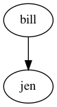

# clingraph

A visualizer for graphs defined as a set of facts computed from logic programs. Graphs are generated using [graphviz](https://graphviz.org) defined via fixed predicates from a list of facts. 


It contains special features for integration with [clingo](https://potassco.org/clingo/)!


## Installation

Standing on the root folder install all dependencies:

```
pip install .
```

This will make the command `clingraph` available for usage.

## Usage

*clingraph* can be used as a python library (see [example jupyter](package_usage.ipynb) for a quick start), of via the command line.
The graphs can be created from files or from a piped output string.
The output will be the dot source code of the defined graphs. 
Graphs can also be rendered and saved in a directory in different formats.

Special integration for clingo includes the creation of graphs for multiple stable models from a clingos' json output. 

For more available options see the help:
```shell
clingraph --help
```
```
      _ _                         _
    __| (_)_ _  __ _ _ _ __ _ _ __| |_
  / _| | | ' \/ _` | '_/ _` | '_ \ ' \
  \__|_|_|_||_\__, |_| \__,_| .__/_||_|
              |___/         |_|

  Clingraph is a package to generate graph visualizations
  based on facts that can be computed by logic programs.
  Special features for integration with clingo!


  positional arguments:
    files

  optional arguments:
    -h, --help            show this help message and exit
    -q                    Flag to have a quiet output where the graphs soruce wont be rendered
    -log                  Provide logging level.
                          {debug|info|error|warning}
                              (default: warning)

  Graph generation:
    --type                The type of the graph: digraph or graph
                          {graph|digraph}
                              (default: graph)
    --prefix              Prefix expected in all the considered facts
    --default-graph       The name of the default graph.
                          All nodes and edges with arity 1 will be assigned to this graph
                          (default: default)

  Graph rendering:
    --render              Flag to render the graphs and save in files
    --dir                 Directory for saving and rendering
                              (default: out)
    --out-file-prefix     A prefix for the names of the generated files
                              (default: )
    --format              Format to save the graph
                          {pdf|png|svg}
                              (default: pdf)
    --engine              Layout command used by graphviz
                          {dot|neato|twopi|circo|fdp|osage|patchwork|sfdp}
                              (default: dot)
    --view                Opens the generated files
    --select-graph  [ ...]
                          Select one of the graphs for output or rendering by name
                          Can appear multiple times to select multiple graphs
    --gif                 Flag to generate a giv from all the generated files
    --gif-name            Name for the gif file that will be saved in the given directory

  Multi model graphs:
    --json                Flag to indicate the creation of multiple models from a json.
                          The graphs will be generated for each stable model.
                          The json is expected to be the output of clingo using the option `--outf=2`
    --select-model []     Select only one of the models outputed by clingo defined by a number
```


### Syntax

Graphs are defined via facts using predicates `node`, `edge`, `graph` and `attr` as explained below (a custom prefix for these names can be defined in the command line). All the following examples can be found in the [examples/basic](./examples/basic) directory.

- #### **Nodes**

  A node is defined using predicate `node/1` where the argument is an identifier.

  ###### *Example 1*
  ```
  node(john).
  node(jane).
  ```

- #### **Edges**

  An edge from `A` to `B` is defined using predicate `edge/1` where the argument is a tuple `(A,B)`. The edges will be directed when creating a `digraph` and not directed one created a `graph` (this is defined via command line).

  ###### *Example 1 (continuation)*
  ```
  edge((john,jane)).
  ```
  

- #### **Graphs**

  A graph `A` is defined using predicate `graph/1`.

  ###### *Example*
  ```
  graph(family).
  ```

  - **Multiple graphs** can be defined within the same logic program. Each of them will generate a different file. In order to assign a node or edge to an specific graph we add the identifier of the graph in the second argument. All nodes and edges defined with a single argument are assigned to the default graph called `default`. A different graph can be defined as the default in the command line.

    ###### *Example 2*

    ```
    graph(toms_family).
    graph(bills_family).
    node(tom, toms_family).
    node(max, toms_family).
    edge((tom, max), toms_family).
    node(bill, bills_family).
    node(jen, bills_family).
    edge((bill, jen), bills_family).
    ```
    Graph 1             |  Graph 2
    :-------------------------:|:-------------------------:
      |      


  - **Subgraphs** can be defined by adding a parent graph as a second argument. Then, nodes and edges can be assigned to a subgraph or a graph in the same way.

    ###### *Example 3*

    ```
    graph(house).
    graph(bathroom, house).
    graph(bedroom, house).
    node(toilet,bathroom).
    node(bed,bedroom).
    edge((toilet,bed),house).
    ```
    

- #### **Attributes**

  The attributes of an element (graph, node or edge) are defined using predicate `attr/4`. This predicate will add any attributes accepted by graphviz ([see here](https://graphviz.org/doc/info/attrs.html)) specified by name-value pairs to the element.

  - `attr(ELEMENT_TYPE, ELEMENT_ID, ATTR_NAME, ATTR_VALUE).`
    - `ELEMENT_TYPE` The type of element: can be `graph`, `node` or `edge`. Additionally, the element types `graph_nodes` and `graph_edges` assign an attribute to all nodes/edges of a graph identified with `ELEMENT_ID`.
    - `ELEMENT_ID` The identifier of the element
    - `ATTR_NAME` The name of the graphviz attribute
    - `ATTR_VALUE` The value of the graphviz attribute

  ###### *Example 3 (continuation)*

  ```
  attr(graph, house, label, "Tom's House").
  attr(graph, bathroom, style, dotted).
  attr(graph, bathroom, label, "Bathroom").
  attr(graph, bedroom, style, dotted).
  attr(graph, bedroom, label, "Bedroom").
  attr(graph_nodes, house, style, filled).
  attr(graph_nodes, house, color, cyan).
  attr(node, toilet, shape, circle).
  attr(node, bed, shape, square).
  attr(edge, (toilet,bed), color, red).
  ```
  

  ###### *Example 1 (continuation)*

  ```
  attr(graph, default, label, "Does' family").
  attr(graph_nodes, default, style, filled).
  attr(node, john, label, "John Doe").
  attr(node, jane, label, "Jane Doe").
  ```
  

  ##### Special multi attribute
  
  If multiple occurrences of the same attribute name for a specific element are present, then the values will be concatenated in no specific order. To define an order the attribute name can be a tuple where the second value is the position where the value will be considered. Furthermore, if the position is the special word `"sep"`  the value will be cosidered as the separator of the strings in the concatenation


  ###### *Example 4*
  ```
  node(mike).
  attr(node, mike, (label,0), "Michel").
  attr(node, mike, (label,1), "Scott").
  node(toby).
  edge((mike,toby)).
  attr(edge, (mike,toby)), label, "enemy").
  attr(edge, (mike,toby)), label, "hate").
  attr(edge, (mike,toby)), label, "boss").
  attr(edge, (mike,toby)), (label,"sep"), "-").
  ```
  


### Advanced usage

For more advanced examples look into the [examples](./examples) directory. Each folder contains a readme on how to run the example.

#### Dynamic applications

For visualizing dynamic applications one can create multiple graphs for each time step to generate a gif. See example [examples/asprilo](./examples/asprilo/README.md).
