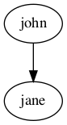
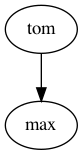
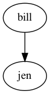
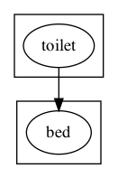
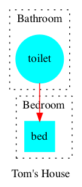

# Think tank

### Syntax

- #### **Nodes**

  A node is defined using predicate `node/1` where the argument is an identifier.

  ###### *Example 1*
  ```
  node(john).
  node(jane).
  ```

- #### **Edges**

  An edge from `A` to `B` is defined using predicate `edge/1` where the argument is a tuple `(A,B)`. The edges will be directed when creating a `digraph` and not directed one created a `graph` (this is defined via command line).

  ###### *Example 1 (continuation)*
  ```
  edge((john,jane)).
  ```
  

>**ISSUE:**
>`edge(A,B)` is faster to write but then the elements have different arities
>`edge((A,B))` is anoying but `(A,B)` is used as a tuple in `attr` anyway
>    You can add more elements


- #### **Graphs**

  A graph `A` is defined using predicate `graph/1`.

  ###### *Example*
  ```
  graph(family).
  ```

  - **Multiple graphs** can be defined within the same logic program. Each of them will generate a different file. In order to assign a node or edge to an specific graph we add the identifier of the graph in the second argument. All nodes and edges defined with a single argument are assigned to the default graph called `default`. A different graph can be defined as the default in the command line.


    ###### *Example 2*

    ```
    graph(toms_family).
    graph(bills_family).

    node(tom, toms_family).
    node(max, toms_family).
    edge((tom, max), toms_family).

    node(bill, bills_family).
    node(jen, bills_family).
    edge((bill, jen), bills_family).
    ```
    Graph 1             |  Graph 2
    :-------------------------:|:-------------------------:
      |      


  - **Subgraphs** can be defined by adding a parent graph as a second argument. Then, nodes and edges can be assigned to a subgraph or a graph in the same way.

    ###### *Example 3*

    ```
    graph(house).
    graph(bathroom, house).
    graph(bedroom, house).

    node(toilet,bathroom).
    node(bed,bedroom).

    edge((toilet,bed),house).
    ```
    

> Can you add an edge from/to a subgraph?
- #### **Attributes**

  The attributes of an element (graph, node or edge) are defined using predicate `attr/4`. This predicate will add any attributes accepted by graphviz ([see here](https://graphviz.org/doc/info/attrs.html)) specified by name-value pairs to the element.

  - `attr(ELEMENT_TYPE, ELEMENT_ID, ATTR_NAME, ATTR_VALUE).`
    - `ELEMENT_TYPE` The type of element: can be `graph`, `node` or `edge`. Additionally, the element types `graph_nodes` and `graph_edges` assign an attribute to all nodes/edges of a graph identified with `ELEMENT_ID`.
    - `ELEMENT_ID` The identifier of the element
    - `ATTR_NAME` The name of the graphviz attribute
    - `ATTR_VALUE` The value of the graphviz attribute

  ###### *Example 3 (continuation)*

  ```
  attr(graph, house, label, "Tom's House").
  attr(graph, bathroom, style, dotted).
  attr(graph, bathroom, label, "Bathroom").
  attr(graph, bedroom, style, dotted).
  attr(graph, bedroom, label, "Bedroom").

  attr(graph_nodes, house, style, filled).
  attr(graph_nodes, house, color, cyan).

  attr(node, toilet, shape, circle).
  attr(node, bed, shape, square).

  attr(edge, (toilet,bed), color, red).
  ```
  

  ###### *Example 1 (continuation)*

  ```
  attr(graph, default, label, "Does' family").

  attr(graph_nodes, default, style, filled).
  attr(node, john, label, "John Doe").
  attr(node, jane, label, "Jane Doe").
  ```
  

> **ISSUE**:
> - Multiple labels or a label constructed via different predicates
> 
> ```
> person(1).
> first_name(1, "Michel").
> last_name(1, "Scott").
> node(1).
> attr(node,X,label,@concatenate(N," ",L)):- person(X), first_name(X,N), last_name(X,L).
> ```
> More complex with multiple predicates defining a label. At the moment using nested tuples and python scripts. Repeating issue... :weary:
> - Idea using tuples attributes as for
> ```
> person(1).
> first_name("Michel").
> last_name("Scott").
> node(1).
> attr(node,X,(label,0),N):- person(X), first_name(X,N).
> attr(node,X,(label,1),L):- person(X), last_name(X,L).
> attr(node,X,(label,"sep")," ").
> ```
>  - Idea using tuples attributes as for
> ```
> person(1).
> first_name("Michel").
> last_name("Scott").
> node(1).
> attr(node,X,label,N):- person(X), first_name(X,N).
> attr(node,X,label,L):- person(X), last_name(X,L).
> attr(node,X,(label,"sep")," ").
> ```
> Have an option for a set where you don't define the index
> - Idea have some predefined utils python scripts  
> ```
> #script (python)
> from clingo.symbol import String
> def pos(x,y):
>     return String(f"{str(x)},{str(y)}!")
> 
> def join(base,*args):
>     return String(str(base).strip('"').join([str(x).strip('"') for x in args]))
> #end.
> ```

> **ISSUE**:
> - Multi edges
> No clear solution for this. Not a built in behavior

-------

## Library idea

#### Construct a clingraph
```python 
from clingraph import Clingraph

# From a string/encoding containing facts
g = Clingraph.from_program(prg ="node(a). node(b).", 
             type= "digraph", engine = "dot", prefix= "viz_", default_graph= "sudoku")
# From a list of files containing facts
g = Clingraph.from_files(files = ["out.lp"])
# From a clorm factbase
g = Clingraph.from_clorm_factbase(fb = factbase)
# From a model
g = Clingraph(clingo_model = model)
ctl.solve(on_model= lambda m: Clingraph(clingo_model=m))

# From a clingo json output
json = {
  "Solver": "clingo version 5.4.0",
  "Input": ["stdin"],
  "Call": [
    {
      "Witnesses": [
        {
          "Value": [

          ]
        },
        {
          "Value": [
            "c"
          ]
        },
        {
          "Value": [
            "b", "a"
          ]
        },
        {
          "Value": [
            "b", "c", "a"
          ]
        }
      ]
    }
  ],
  "Result": "SATISFIABLE",
  "Models": {
    "Number": 4,
    "More": "no"
  },
  "Calls": 1,
  "Time": {
    "Total": 0.001,
    "Solve": 0.000,
    "Model": 0.000,
    "Unsat": 0.000,
    "CPU": 0.001
  }
}
g_dic = clingraph.from_json(json="")
```

> **ISSUES**:
> - Do we want to define a prefix for all predicates or something individual?
> - Do we want to keep all arguments in the creation, like directory and engine or leave it for the save?
> - Why not just a function instead of a class?
#### Access attributes

-We consider saving multiple graphs in the same encoding so the output would be a dictionary of all graphs by name


```python
graphviz_objects = g.graphs
#  {
#   "time1": <gaphviz.Graph>,
#   "time2": <gaphviz.Graph>
#  }
```


Accesing other graphviz attributes 


```python
source = g.graphs["time1"].source
```


#### Save graphs

Save all graphs in a given directory, since we have multiple graphs the file name was intended to be the one defined in the code.

```python
g.save(directory = "path/to/out", name_prefix = "new_version", **graphviz_options)
```

Create a gif from all the graphs
```python
g.gif(directory = "path/to/out", name = "movie", **imageio_options)
```

Create a text for each graph
```python
g.tex(directory = "path/to/out", name_prefix = "new_version", **dot2tex_options)
```

-------

## Command Line

#### Pipe
Pipe output from clingo or a clingo application
```shell
echo "agent(a). agent(b). node(X):-agent(X)." | clingo --outf=1 | clingraph 
```
```shell
% clingo version 5.5.0
% Reading from stdin
% Solving...
% Answer: 1
ANSWER
agent(a). agent(b). node(a). node(b).
%
% Models         : 1
% Calls          : 1
% Time           : 0.001s (Solving: 0.00s 1st Model: 0.00s Unsat: 0.00s)
% CPU Time       : 0.001s
```

> **ISSUES:** 
> - Can we remove the word ANSWER? or use something like 
>   `--out-atomf=%s. --warn=none | head -n5 | tail -n1`
> - Could we give a functionality that does this for you?
> - What if we want a graph for each stable model?

#### From files

```shell
clingraph outputs/sm1.lp
```

#### Command line arguments

 To create
  - `--type=   graph: not-directed digraph: directed`
  - `--engine={dot|neato|twopi|circo|fdp|osage|patchwork|sfdp}`
  - `--prefix=`
  - `--default-graph=`
  
  To save
  - `--directory=`
  - `--format {gv|pdf|png|svg|gif|tex}`
  - `--[no-]view`

Arguments for other tools

-  ` --graphviz-args`
-  `--dot2tex-args`
-  `--imageio-args`


