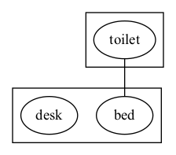
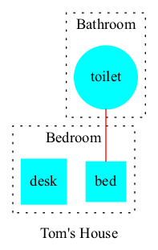
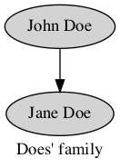
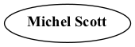

Syntax
######

Graphs are defined via facts using predicates ``node``, ``edge``,
``graph`` and ``attr``. 


.. note:: A custom prefix for the predicate names can be defined to avoid clashes with other existing predicates. 

Nodes
=====

A node is defined using predicate ``node`` where the argument is an
identifier.

.. rubric:: *Example 1*
    :name: example-1

::

    node(john).
    node(jane).

Edges
=====

An edge from ``A`` to ``B`` is defined using predicate ``edge``
where the argument is a tuple ``(A,B)``. The edges will be directed
when creating a ``digraph`` and not directed one created a ``graph``.

.. rubric:: *Example 1 (continuation)*
    :name: example-1-continuation

::

    edge((john,jane)).

.. figure:: ../../examples/doc/example1/example1.1.png


Graphs
======

A graph is defined using predicate ``graph/1``.

.. rubric:: *Example*
    :name: example

::

       graph(family).

Multiple graphs
---------------
    
Multiple graphs can be defined within the same set of facts.
Each of them will generate a different graph. In order to assign a
node or edge to a specific graph we add the identifier of the
graph in the second argument. 

.. warning:: All nodes and edges defined with a
    single argument are assigned to the default graph called
    ``default``. A different graph can be defined as the default as an option.

.. rubric:: *Example 2*
    :name: example-2

::

    graph(toms_family).
    graph(bills_family).
    node(tom, toms_family).
    node(max, toms_family).
    edge((tom, max), toms_family).
    node(bill, bills_family).
    node(jen, bills_family).
    edge((bill, jen), bills_family).

.. list-table:: 

    * - .. figure:: ../../examples/doc/example2/toms_family.png

           *Graph toms_family*

      - .. figure:: ../../examples/doc/example2/bills_family.png

           *Graph bills_family*

.. note:: The creation of multiple graphs is especially useful for representing a dynamic domain where we need a different visualization for each time step


Subgraphs
---------

Subgraphs can be defined by adding a parent graph as a second
argument to the ``graph`` predicate. Then, nodes and edges can be assigned to a subgraph or a graph in the same way.

.. rubric:: *Example 3*
    :name: example-3

::

    graph(house).
    graph(bathroom, house).
    graph(bedroom, house).
    node(toilet,bathroom).
    node(bed,bedroom).
    node(desk,bedroom).
    edge((toilet,bed),house).



Attributes
==========

The attributes of an element (graph, node or edge) are defined using
predicate ``attr``. This predicate will add any attributes accepted
by graphviz (`see here <https://graphviz.org/doc/info/attrs.html>`__)
specified by name-value pairs to the element.

*  ``attr(ELEMENT_TYPE, ELEMENT_ID, ATTR_NAME, ATTR_VALUE).``

   * ``ELEMENT_TYPE``: The type of element: can be ``graph``,
     ``node`` or ``edge``. Additionally, the element types
     ``graph_nodes`` and ``graph_edges`` assign an attribute to all
     nodes/edges of a graph identified with ``ELEMENT_ID``.

   * ``ELEMENT_ID``: The identifier of the element
  
   * ``ATTR_NAME``: The name of the graphviz attribute
  
   * ``ATTR_VALUE``: The value of the graphviz attribute

.. rubric:: *Example 3 (continuation)*
    :name: example-3-continuation

::

    attr(graph, house, label, "Tom's House").
    attr(graph, bathroom, style, dotted).
    attr(graph, bathroom, label, "Bathroom").
    attr(graph, bedroom, style, dotted).
    attr(graph, bedroom, label, "Bedroom").
    attr(graph_nodes, house, style, filled).
    attr(graph_nodes, house, color, cyan).
    attr(node, toilet, shape, circle).
    attr(node, bed, shape, square).
    attr(node, desk, shape, square).
    attr(edge, (toilet,bed), color, red).




.. note:: To edit the attributes of the default graph one must use the default name as element id.

.. rubric:: *Example 1 (continuation)*
    :name: example-1-continuation-1

::

    attr(graph, default, label, "Does' family").
    attr(graph_nodes, default, style, filled).
    attr(node, john, label, "John Doe").
    attr(node, jane, label, "Jane Doe").



Template attribute
------------------

The value of any attribute can also be a template.
More specifically, we use Jinja templates (See the template syntax `here <https://jinja.palletsprojects.com/en/3.1.x/templates/>`__ ). 
The template is then rendered with the variables provided in additional ``attr`` predicates. 
In such predicates, the name attribute name will be a tuple ``(ATTR_NAME, VARIABLE)`` and the corresponding ``ATTR_VALUE`` will correspond to the value of the given variable. 
We can see an example bellow, where the value of attribute ``label`` is now a template ``"<<b>{{name}} {{lastname}}</b>>"`` in which variables enclosed under ``{{ }}``` will be substituted. The following lines give values to such variables by using the tuples ``(label,name)`` and ``(label,lastname)`` as attribute names.
As a result, the value of label will be ``"<<b>Michel Scott</b>>"``.
Moreover, this label corresponds to an `HTML-Like label <https://graphviz.org/doc/info/shapes.html#html>`__, since it is encosed by ``<>``. 
Particularly, the tag ``<b>`` used in this label will make the font boldface as seen in the figure bellow.

.. rubric:: *Example 4*
    :name: example-4

::

    node(mike).
    attr(node, mike, label, "<<b>{{name}} {{lastname}}</b>>").
    attr(node, mike, (label,name), "Michel").
    attr(node, mike, (label,lastname), "Scott").



The default template will simply concatenate all variable values in no specific order as follows: ``{{v}}``. 
This template uses the ``for`` statement, to iterate over the items in ``data``.
The special variable ``data`` is a dictionary containing all variables defined via tuples with their corresponding value. 
In the example below, no template is provided for attribute ``label`` of node ``jim`` therefore the value will be either ``JimHalpert`` or ``HalpertJim``

.. rubric:: *Example 4 (continuation)*
    :name: example-4-continuation

::

    node(jim).
    attr(node, jim, (label,name), "Jim").
    attr(node, jim, (label,lastname), "Halpert").


If multiple occurrences of a variable name appear, then the variable will be a set which can be further iterated in the template. In our example, the variable ``name``

TODO! I dont like this 

.. rubric:: *Example 4 (continuation)*
    :name: example-4-continuation2

::

    node(pam).
    attr(node, pam, label, "{{n}} {{lastname}}").
    attr(node, pam, label, "Pam").
    attr(node, pam, (label,name), "Pamela").
    attr(node, pam, (label,name), "Morgan").
    attr(node, pam, (label,lastname), "Beesly").


Although the variable names can be things other than constants, such as tuples, functions, integers or more complex strings, these type of values wont be accessible in the template in the same way. For instance in predicate ``attr(node, n, (label,1), a)`` the variable ``1`` is assigned value ``a``. Notice that ``1`` is not really a variable that can be accessed via ``{{1}}`` since this would be the number 1 rather than the variable. Therefore, these variables should be accessed via the ``data`` dictionary like ``{{data[1]}}``. 