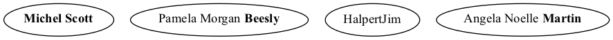

Syntax
######

Graphs are defined via facts using predicates ``node``, ``edge``,
``graph`` and ``attr``. 

.. note:: A custom prefix for the predicate names can be defined to avoid clashes with other existing predicates. 

Nodes
=====

A node is defined using predicate ``node`` where the argument is an
identifier.

.. rubric:: *Example 1*
    :name: example-1

::

    node(john).
    node(jane).

Edges
=====

An edge from ``A`` to ``B`` is defined using predicate ``edge``
where the argument is a tuple ``(A,B)``. The edges will be directed
when creating a ``digraph`` and not directed one created a ``graph``.

.. rubric:: *Example 1 (continuation)*
    :name: example-1-continuation

::

    edge((john,jane)).

.. figure:: ../../examples/doc/example1/example1.1.png

Graphs
======

A graph is defined using predicate ``graph/1``.

.. rubric:: *Example*
    :name: example

::

       graph(family).

Multiple graphs
---------------
    
Multiple graphs can be defined within the same set of facts.
Each of them will generate a different graph. In order to assign a
node or edge to a specific graph we add the identifier of the
graph in the second argument. 

.. warning:: All nodes and edges defined with a
    single argument are assigned to the default graph called
    ``default``. A different graph can be defined as the default as an option.

.. rubric:: *Example 2*
    :name: example-2

::

    graph(toms_family).
    graph(bills_family).
    node(tom, toms_family).
    node(max, toms_family).
    edge((tom, max), toms_family).
    node(bill, bills_family).
    node(jen, bills_family).
    edge((bill, jen), bills_family).

.. list-table:: 

    * - .. figure:: ../../examples/doc/example2/toms_family.png

           *Graph toms_family*

      - .. figure:: ../../examples/doc/example2/bills_family.png

           *Graph bills_family*

.. note:: The creation of multiple graphs is especially useful for representing a dynamic domain where we need a different visualization for each time step

Subgraphs
---------

Subgraphs can be defined by adding a parent graph as a second
argument to the ``graph`` predicate. Then, nodes and edges can be assigned to a subgraph or a graph in the same way.

.. rubric:: *Example 3*
    :name: example-3

::

    graph(house).
    graph(bathroom, house).
    graph(bedroom, house).
    node(toilet,bathroom).
    node(bed,bedroom).
    node(desk,bedroom).
    edge((toilet,bed),house).

.. figure:: ../../examples/doc/example3/house.png

Attributes
==========

The attributes of an element (graph, node or edge) are defined using
predicate ``attr``. This predicate will add any attributes accepted
by graphviz (`see here <https://graphviz.org/doc/info/attrs.html>`__)
specified by name-value pairs to the element.

*  ``attr(ELEMENT_TYPE, ELEMENT_ID, ATTR_NAME, ATTR_VALUE).``

   * ``ELEMENT_TYPE``: The type of element: can be ``graph``,
     ``node`` or ``edge``. Additionally, the element types
     ``graph_nodes`` and ``graph_edges`` assign an attribute to all
     nodes/edges of a graph identified with ``ELEMENT_ID``.

   * ``ELEMENT_ID``: The identifier of the element
  
   * ``ATTR_NAME``: The name of the graphviz attribute
  
   * ``ATTR_VALUE``: The value of the graphviz attribute

.. rubric:: *Example 3 (continuation)*
    :name: example-3-continuation

::

    attr(graph, house, label, "Tom's House").
    attr(graph, bathroom, style, dotted).
    attr(graph, bathroom, label, "Bathroom").
    attr(graph, bedroom, style, dotted).
    attr(graph, bedroom, label, "Bedroom").
    attr(graph_nodes, house, style, filled).
    attr(graph_nodes, house, color, cyan).
    attr(node, toilet, shape, circle).
    attr(node, bed, shape, square).
    attr(node, desk, shape, square).
    attr(edge, (toilet,bed), color, red).

.. figure:: ../../examples/doc/example3/house2.png

.. note:: To edit the attributes of the default graph one must use the default name as element id.

.. rubric:: *Example 1 (continuation)*
    :name: example-1-continuation-1

::

    attr(graph, default, label, "Does' family").
    attr(graph_nodes, default, style, filled).
    attr(node, john, label, "John Doe").
    attr(node, jane, label, "Jane Doe").

.. figure:: ../../examples/doc/example1/example1.2.png

Multi-attribute
---------------

If multiple occurrences of the same attribute name for a specific
element are present, then the values will be concatenated in no
specific order. To define an order the attribute name can be a tuple
where the second value is the position where the value will be
considered. Furthermore, if the position is
``sep`` the value will be considered as the separator of the strings
in the concatenation.

.. rubric:: *Example 4*
    :name: example-4

::

    node(mike).
    attr(node, mike, (label,0), "Michel").
    attr(node, mike, (label,1), "Scott").
    node(toby).
    edge((mike,toby)).
    attr(edge, (mike,toby)), label, "enemy").
    attr(edge, (mike,toby)), label, "hate").
    attr(edge, (mike,toby)), label, "boss").
    attr(edge, (mike,toby)), (label,sep), "-").

