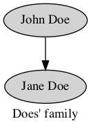

.. clingraph documentation master file, created by
   sphinx-quickstart on Tue Jan 25 09:58:55 2022.
   You can adapt this file completely to your liking, but it should at least
   contain the root `toctree` directive.

Clingraph: A declarative graph visualizer
=========================================

A visualizer for graphs defined as a set of facts that can be computed from logic programs. The graphs are generated using `graphviz <https://graphviz.org>`_ but are defined via fixed predicates from a list of facts.

The package also contains special features for integration with `clingo <https://potassco.org/clingo>`_ as well as to create gifs and latex code!

**Here is a motivation example:**

.. code-block::
   
   node(john).
   node(jane).
   edge((john,jane)).

   attr(graph, default, label, "Does' family").

   attr(graph_nodes, default, style, filled).
   attr(node, john, label, "John Doe").
   attr(node, jane, label, "Jane Doe").

Then clingraph will load this facts and construct a graphviz object that can be rendered, saved and more! 

.. note:: Clingraph is part the Potassco umbrella (which is the home of Clingo and the other ASP tools)

.. toctree::
   :maxdepth: 2
   :caption: Contents:
   
   clingraph/installation
   clingraph/syntax
   notebook.ipynb
   clingraph/api 
   clingraph/console

