# Clingraph Examples 
Our **[examples folder](.)** shows how to use the range of functionalities in different applications. 

- :turtle: Examples used in the [documentation](https://clingraph.readthedocs.io/en/latest/index.html) ([doc](doc))
  - Attribute definition ([example1](doc/example1))
  - Multi graphs ([example2](doc/example2))
  - Subgraphs ([example3](doc/example3))
  - Complex attributes ([example4](doc/example4))
  - Clingo integration with multi model ([example5](doc/example5))
  - Latex integration ([example6](doc/example6))
- :turtle: Simple ([color](color), [cube](cube), [lights](lights))
- :rabbit2: Clingo integration ([sudoku](sudoku), [reify](reify), [transition_system](transition_system))
  - Absolute positioning
  - Legends
  - Latex integration
  - HTML labels
- :rabbit2: Dynamic applications ([asprilo](asprilo), [elevator](elevator), [minotaur](minotaur))
  - Clingo integration
  - Multi graphs
  - Animation
- :rabbit2: SVG interaction ([tree](tree), [family_tree](family_tree), [queens_interactive](queens_interactive), [minesweeper](minesweeper)),  [traveling_sales_person_clickable](traveling_sales_person_clickable)), 
  - Interactivity using svg

----
## Simple 

#### Coloring
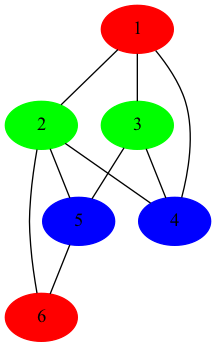

#### Lights
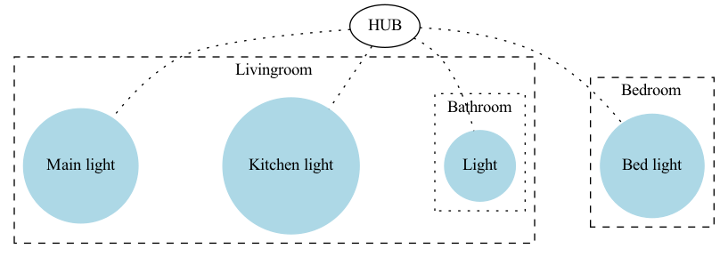

----
## Clingo integration 

#### Sudoku

#### Transition System
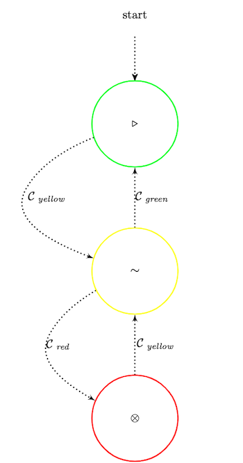

#### Reify

#### UML Class Diagram
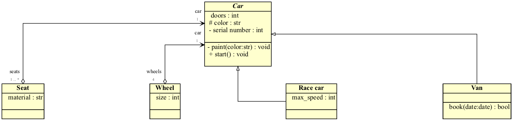

----
## Dynamic applications

#### Minotaur
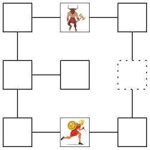

#### Elevator
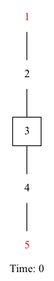

#### Asprilo
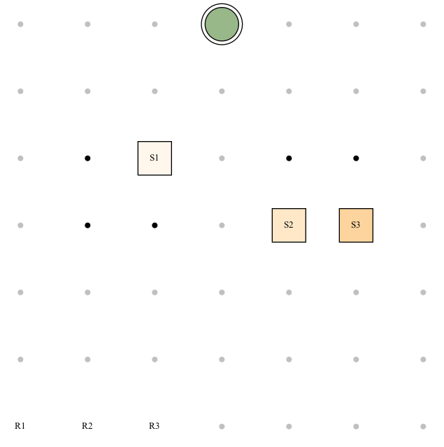

----
## SVG interaction

#### Tree
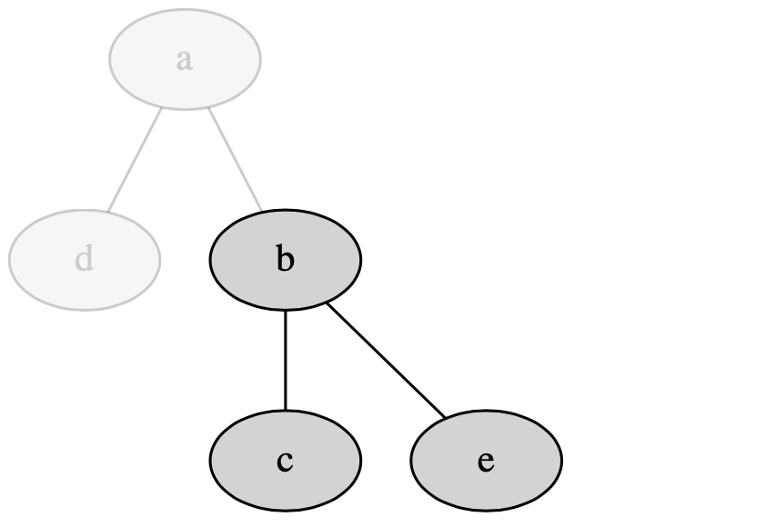

#### Queens interactive 
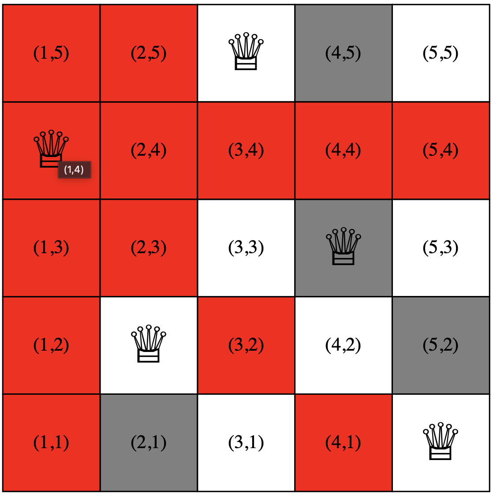

#### Minesweeper
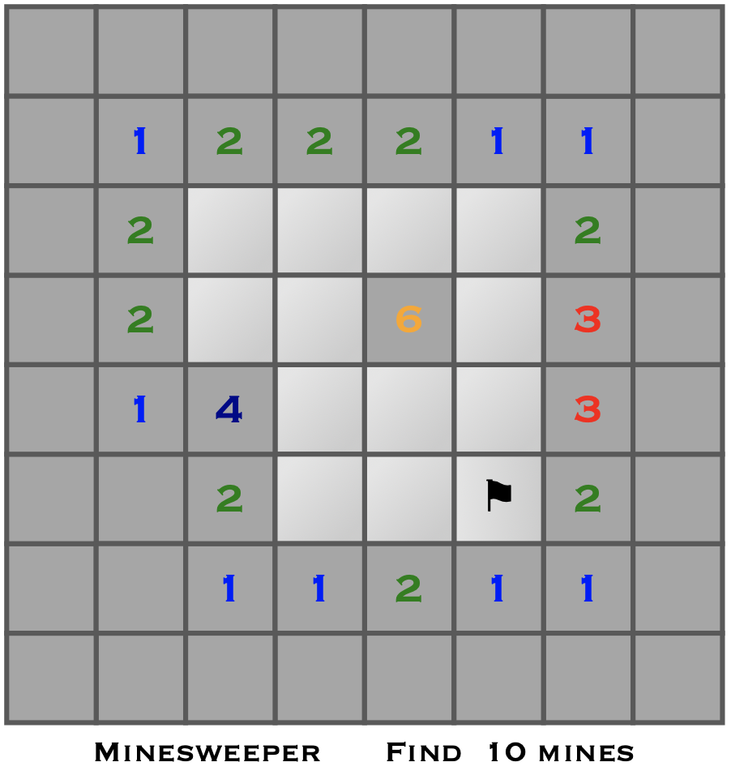

#### Family Tree
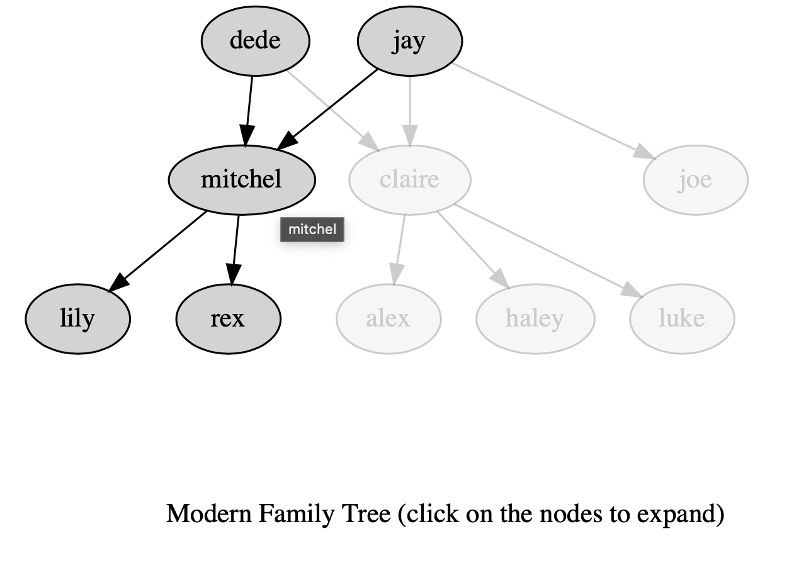

----
## Other

#### Propagator
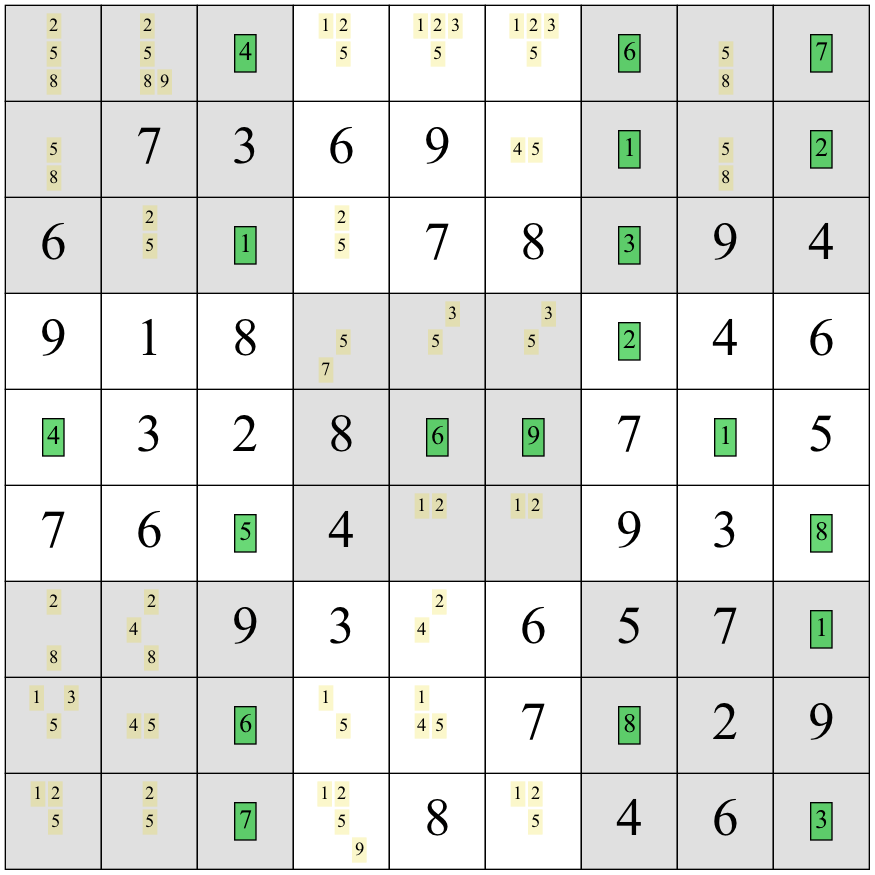

