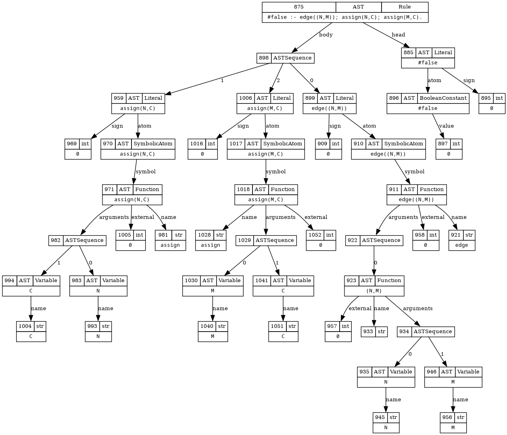

### Abstract syntax tree

This example renders clingo's abstract syntax tree.

**Features used:**
- Rendering

`./reify_ast.py program.lp | clingraph --viz-encoding=viz.lp --type=digraph --out=render --format=png`

