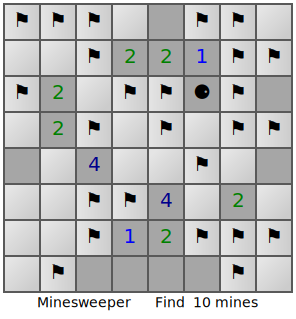

### Minesweeper

The minesweeper game using svg interactivity

https://en.wikipedia.org/wiki/Minesweeper_(video_game)

**Features used:**
- SVG interactivity
- Gradient colors

`clingo examples/minesweeper/encoding.lp --outf=2 | clingraph --viz-encoding examples/minesweeper/viz.lp --out=render --view --engine=neato --select-model=0 --format=svg`

Notice that you must download the `svg` file. Otherwise GitHub will prevent the `svg` scripts from running.

