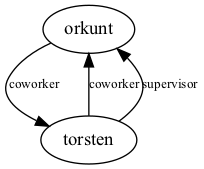

### Multi edge

Multi edges can be defined using a tuple of size 4 for the edge instead of size 2

`edge((N1,N2,Name,Arity))`

Where the connection is between node `N1` and node `N2` and the edge is called `Name` with arity `Arity`. 

**Features used:**
- Multi edges

`cat examples/multi_edge/encoding.lp | clingraph --viz-encoding examples/multi_edge/viz.lp --out=render --view --type digraph`

