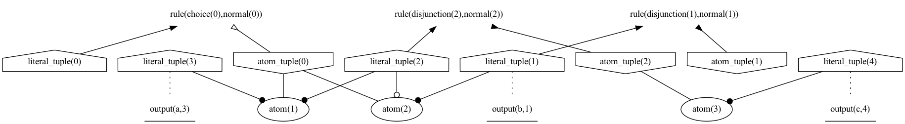

### Reified format

Shows the reification output of gringo 

**Features used:**
- Load from clingo
- Select graph
- View
- Viz encoding
- Legend

For this example one must first compute the reification calling `gringo`.
Then we call clingo with our visualization encoding

`gringo examples/reify/program1.lp --output=reify | clingraph --dir='out/reify' --default-graph=program --format=png --select-model=0 --out=render --view --viz-encoding=examples/reify/viz_basic.lp --name-format=basic`

Run example that uses theory atoms and has a legend

`gringo examples/reify/program2.lp --output=reify | clingraph --dir='out/reify' --default-graph=program --format=png --select-model=0 --out=render --view --viz-encoding=examples/reify/viz_all.lp --name-format=theory-label`

