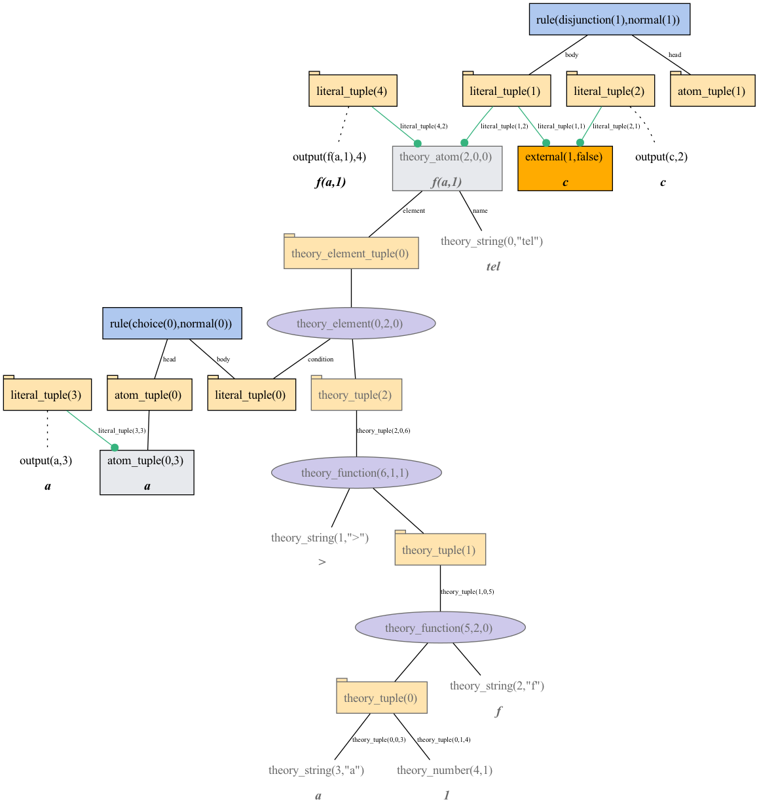

### Reified format

Shows the reification output of gringo 

**Features used:**
- Load from clingo
- Select graph
- View
- Viz encoding

For this example one must first compute the reification with `output=reify`.
Then we call clingraph with our visualization encoding

`clingo examples/reify/program.lp --output=reify | clingraph --dir='out/reify' --format=png --select-model=0 --out=render --view --viz-encoding=examples/reify/viz.lp`

#### Program:
```
#theory theory{
    term {
	 >   : 2, unary;
	 >?  : 1, binary, left
	 };
    &tel/0     : term, any;
    &tel_eq/0     : term, {=}, term, any
}.

:- &tel{ > f(a,1) }, c.
{a}.

#show f(a,1) : &tel{ > f(a,1) }.
#external c.
```

#### Output:



