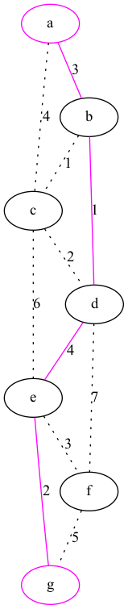

### Shortest path problem

See definition of the problem [here](https://en.wikipedia.org/wiki/Shortest_path_problem)

**Features used:**
- Clingo integration
- Optimization
- Show statements

`clingo examples/shortest_path/encoding.lp --outf=2 --opt-mode=optN -q1  | clingraph --viz-encoding examples/shortest_path/viz.lp --out=render --view --select-model=0 --format=png`

