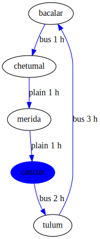

### Traveling sales problem with clickable links

See definition of the problem [here](https://en.wikipedia.org/wiki/Travelling_salesman_problem)

**Features used:**
- SVG output clickable
- Clingo integration
- Optimization
- Negative Model selection

`clingo examples/traveling_sales_person_clickable/instance.lp examples/traveling_sales_person_clickable/encoding.lp --outf=2 --opt-mode=opt | clingraph --viz=examples/traveling_sales_person_clickable/viz.lp --out=render --type=digraph --view --format=svg --select-model=-1`

