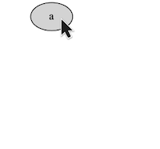
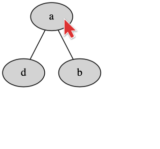
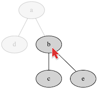
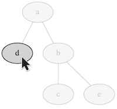

### Expandable tree

A tree that is expanded using svg interactivity

**Features used:**
- SVG interaction

`clingraph examples/tree_expandable/instance.lp --viz examples/tree_expandable/viz.lp --view --out=render --format=svg`

Notice that you must download the `svg` [file](./default.svg) and run it on your computer. Otherwise GitHub will prevent the `svg` scripts from running.
 
    